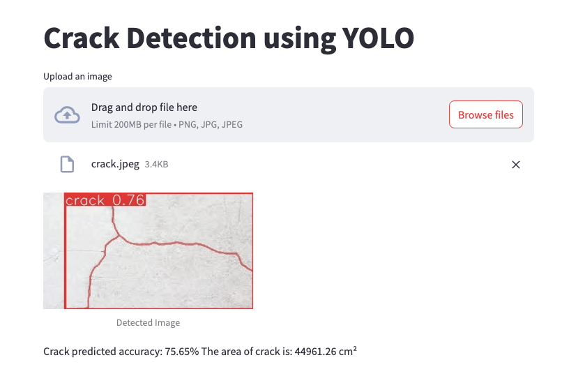

# Crack Detection

Ứng dụng phát hiện vết nứt trong hình ảnh sử dụng YOLO V8 và Streamlit.

## Giới thiệu

Crack Detection là một ứng dụng web dựa trên Streamlit sử dụng mô hình YOLO để phát hiện và phân tích các vết nứt trong hình ảnh. Ứng dụng cung cấp giao diện người dùng thân thiện, cho phép tải lên hình ảnh và nhận kết quả phát hiện chi tiết, bao gồm diện tích vết nứt và độ chính xác dự đoán.

## Tính năng

- Tải lên hình ảnh để phát hiện vết nứt.
- Phát hiện thời gian thực sử dụng mô hình YOLO.
- Hiển thị hình ảnh đã phát hiện với các bounding box.
- Hiển thị diện tích vết nứt và độ chính xác dự đoán.
- Giao diện web dễ sử dụng.

## Demo


[Demo Huggingface](https://huggingface.co/spaces/ducdatit2002/crack-detection).


## Cài đặt

Thực hiện các bước sau để cài đặt và chạy dự án trên máy tính của bạn.

### Yêu cầu hệ thống

- Python 3.7 hoặc cao hơn
- pip (trình quản lý gói của Python)

### Bước 1: Sao chép repository

Mở terminal hoặc command prompt và chạy lệnh sau để sao chép repository về máy:

```bash
git clone https://github.com/ducdatit2002/crack-detection.git
cd crack-detection
```


### Bước 2: Cài đặt các phụ thuộc

```bash
pip install -r requirements.txt
```
Hoặc
```bash
pip install streamlit ultralytics opencv-python Pillow torch torchvision
```
Chạy ứng dụng Streamlit bằng lệnh sau:

```bash
streamlit run app.py
```
